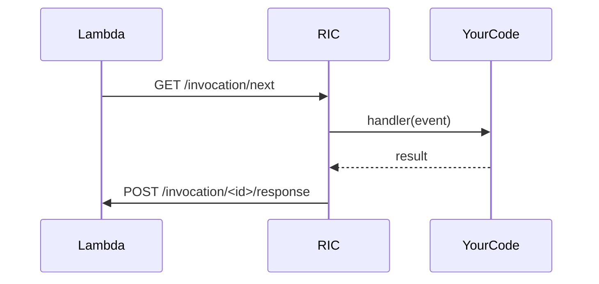

# Session 5: Custom AWS Lambda Runtimes with RIC

A **visual and practical guide** for understanding and deploying AWS Lambda custom runtimes using the **Runtime Interface Client (RIC)**. Tailored for engineers who want full control over Lambda behavior in container images.

---

## 🔍 Workshop Goal

> Understand and deploy a custom Lambda runtime using RIC, and grasp its role in the event processing lifecycle.

✅ Key takeaways:

- Why RIC is essential
- How it interacts with AWS Lambda Runtime API
- Build and deploy a working Lambda with API Gateway using RIC

---

## 🧱 Prerequisites / Setup

Before the session:

- Docker installed
- AWS CLI configured
- Basic understanding of AWS Lambda + API Gateway
- Familiarity with Python or similar language
- Node.js or .NET users: good to compare with managed runtimes

---

## ⚙️ Agenda & Phases

1. 🧠 **Concept: What is RIC and Why It Matters**
2. 🔧 **Build a custom Python runtime**
3. 🚀 **Deploy to AWS Lambda**
4. 🧪 **Test via API Gateway**
5. 🧩 **Deep dive into internal Lambda event flow**

---

## 🧪 Hands-On: Custom Python Lambda with RIC

### 📁 Directory structure

```

/custom-lambda
├── app/
│   └── handler.py
├── requirements.txt
└── Dockerfile

````

### 🐳 Dockerfile

```Dockerfile
FROM python:3.9

COPY app/ /var/task/
RUN pip install --target /var/task awslambdaric
RUN pip install --no-cache-dir -r /var/task/requirements.txt --target /var/task

WORKDIR /var/task
ENTRYPOINT ["/usr/local/bin/python", "-m", "awslambdaric"]
CMD ["app.handler"]
````

---

## 💡 What RIC Actually Does

RIC = Runtime Interface Client → acts as a **layer between AWS Lambda's infra and your function code**.

### 📥 It

- Polls the **Lambda Runtime API** for new events
- Passes the event to your function handler
- Sends the result (or error) back to Lambda

---

### 📊 Flowchart: Internal Event Lifecycle

```mermaid
flowchart TD
    A[AWS Lambda Infra] -->|Invoke| B[Runtime API (localhost:9001)]
    B -->|GET /invocation/next| C[RIC]
    C -->|event → handler(event, ctx)| D[Your Code]
    D -->|result| C
    C -->|POST /invocation/<id>/response| B
    B --> A
```

---

### 🔁 Sequence Diagram: Example Request Handling



---

## 🧠 Summary: .NET vs Python

| Language                                        | Needs RIC? | Why?                                         |
| ----------------------------------------------- | ---------- | -------------------------------------------- |
| .NET (`Amazon.Lambda.AspNetCoreServer.Hosting`) | ❌          | Already implements Runtime API               |
| Python in custom container                      | ✅          | Needs RIC to connect with Lambda Runtime API |

---

## 📈 Expected Outcomes

After this session you’ll be able to:

- Build your own custom Lambda runtime from scratch
- Understand the role of RIC
- Use RIC to handle real events behind API Gateway
- Debug your container using local RIC-based logic

---

## ❓FAQs / Common Issues

- **Do I need RIC if I use AWS base images?**
  → ❌ No. It's already pre-installed.

- **Why doesn’t .NET need RIC?**
  → Because the hosting library already speaks the Runtime API.

- **What happens if I forget to install RIC?**
  → Your Lambda won't start. It’ll hang waiting for an entrypoint or fail with timeout.

---

🔁 Ready to try this live? Let’s build your first custom Lambda runtime now!
