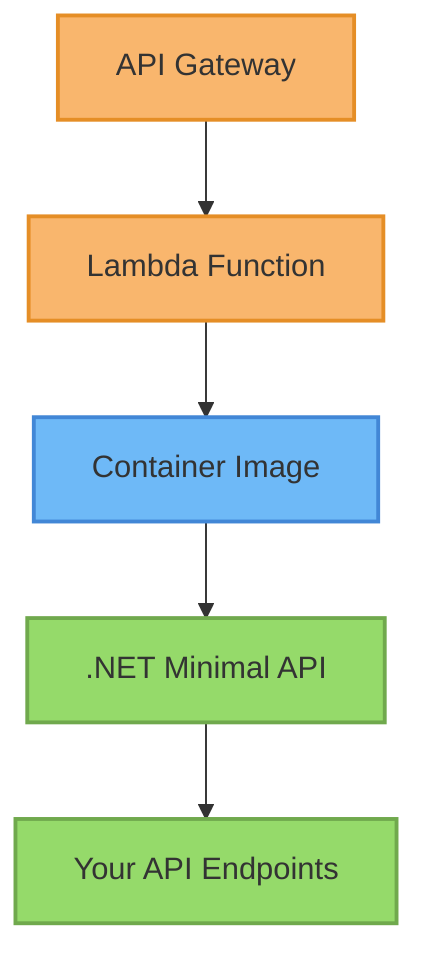

# Implementing API Gateway + Lambda with CDK

This guide explains the practical steps to implement and deploy an API using AWS Lambda and API Gateway through CDK.

## Understanding the Constructs

### The ApiLambdaStack

The `ApiLambdaStack` is a custom CDK construct that simplifies the deployment of Docker-based Lambda functions:

```typescript
// Key components of ApiLambdaStack
const buildingOptions: DockerImageFunctionProps = {
    vpc: props.vpc,                           // VPC where Lambda will run
    vpcSubnets: props.vpcSubnets,             // Subnet placement
    securityGroups: [securityGroup],          // SG for network access
    functionName: name,                       // Lambda function name 
    memorySize: props.memorySizeMbs,          // Memory allocation
    timeout: Duration.seconds(timeout),       // Function timeout
    environment: { /* ENV variables */ },     // Environment variables
    code: DockerImageCode.fromImageAsset(...) // Docker image
};

// Creating the Lambda function
this.lambdaFunction = new DockerImageFunction(
    this,
    `DockerImageFunction-${id}`, 
    buildingOptions
);
```

### The ApiGatewayStack

The `ApiGatewayStack` integrates your Lambda function with API Gateway:

```typescript
// Key components of ApiGatewayStack
const restApi = new LambdaRestApi(this, `LambdaRestApi-${id}`, {
    handler: props.lambdaFunction,           // Lambda function to integrate
    cloudWatchRole: true,                    // Enable CloudWatch logging
    defaultCorsPreflightOptions: {           // CORS configuration
        allowHeaders: [ /* headers */ ],
        allowMethods: Cors.ALL_METHODS,
        allowCredentials: true,
        allowOrigins: Cors.ALL_ORIGINS,
    },
    domainName: {                            // Custom domain configuration
        domainName: `${subdomain}.${domain}`,
        certificate: acmCertificate,
        endpointType: EndpointType.EDGE,
    }
});

// Route53 DNS record to point to the API
new ARecord(this, `ARecord-${id}`, {
    zone: HostedZone.fromLookup(this, "baseZone", { domainName: domain }),
    recordName: `${subdomain}.${domain}`,
    target: RecordTarget.fromAlias(new ApiGateway(restApi)),
});
```

## Step-by-Step Implementation

### 1. Define Your Lambda Properties

```typescript
const lambdaProps: ApiLambdaStackProps = {
    env: { account: "YOUR_ACCOUNT_ID", region: "YOUR_REGION" },
    name: "ApiLambda",
    githubRepo: "cdk-intro-workshop",
    stackName: "cdk-intro-workshop-ApiLambda",
    pathDockerFile: "./workshop/src/apps/Minimal.Api/",
    dockerFile: "Dockerfile",
    envName: "Production",
    functionName: "cdk-intro-workshop-api-production",
    timeoutSeconds: 29,
    memorySizeMbs: 1024,
    vpc: { vpcId: "YOUR_VPC_ID" },
    vpcSubnets: {
        subnetType: SubnetType.PRIVATE_WITH_EGRESS,
    },
};

// Create the Lambda stack
const apiLambdaStack = new ApiLambdaStack(this, lambdaProps);
```

### 2. Define Your API Gateway Properties

```typescript
const apiGatewayProps: ApiGatewayStackProps = {
    env: { account: "YOUR_ACCOUNT_ID", region: "YOUR_REGION" },
    name: "ApiGateway",
    githubRepo: "cdk-intro-workshop",
    stackName: "cdk-intro-workshop-ApiGateway",
    envName: "Production",
    lambdaFunction: apiLambdaStack.lambdaFunction,  // Reference to your Lambda
    certificateArn: "YOUR_CERTIFICATE_ARN",
    subdomain: "api-workshop",
    domain: "example.com",
};

// Create the API Gateway stack
const apiGatewayStack = new ApiGatewayStack(this, apiGatewayProps);
```

### 3. Deploy the Stacks

Deploy the Lambda stack first:

```bash
cdk deploy cdk-intro-workshop-ApiLambda-production-stack
```

Then deploy the API Gateway stack:

```bash
cdk deploy cdk-intro-workshop-ApiGateway-production-stack
```

### 4. Test the API Endpoint

Once deployed, you can test your API:

```bash
curl -v https://api-workshop.example.com/health
```

## Architecture Diagram



## Troubleshooting Common Issues

1. **Lambda Function Timeout**: Check the `timeoutSeconds` property
2. **CORS Issues**: Verify the `defaultCorsPreflightOptions` settings
3. **DNS Resolution**: Ensure Route53 records are correctly configured
4. **VPC Connectivity**: Lambda needs appropriate subnet and security group configuration
5. **Docker Build Errors**: Check the Dockerfile and build context path
