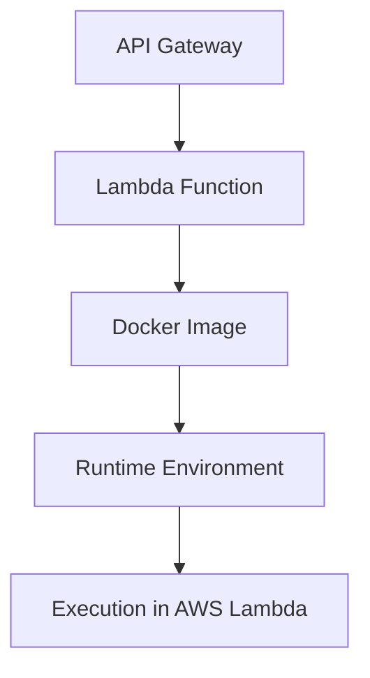

# Deploy API with API Gateway and Lambda

## **Overview**

This guide explains how to deploy an API using AWS API Gateway integrated with AWS Lambda. This setup is ideal for serverless applications with low latency and scalability.

## **Steps**

### 1. Define the Lambda Function

Use the `createApiLambdaStack` method to define your Lambda function and API Gateway integration. Specify runtime, handler, and configurations.

**Example:**

```typescript
private createApiLambdaStack(
    name: string,
    dockerfile: string,
    subdomain: string,
): ApiLambdaStack {
    const lambdaExportProps: ApiLambdaStackProps = {
        name: "ApiLambda",
        githubRepo: "my-repo",
        pathDockerFile: "./source-code",
        env: { account: "123456789012", region: "us-east-1" },
        vpc: { vpcId: "vpc-0abcd1234efgh5678" },
        envName: "Production",
        timeoutSeconds: 29,
        memorySizeMbs: 1024,
        vpcSubnets: {
            subnetType: "PRIVATE_WITH_EGRESS",
        },
        stackName: "my-repo-ApiLambda",
        functionName: "my-repo-api",
        dockerFile: "Dockerfile",
    };

    const stack = new ApiLambdaStack(this.props.scope, lambdaExportProps);

    return stack;
}
```

### 2. Define the API Gateway

Use the `createApiGateway` method to integrate the Lambda function with API Gateway.

**Example:**

```typescript
private createApiGateway(
    lambdaFunction: IFunction,
    name: string,
    subdomain: string,
): ApiGatewayStack {
    const apiProps: ApiGatewayStackProps = {
        env: { account: "123456789012", region: "us-east-1" },
        name: "ApiGateway",
        envName: "Production",
        lambdaFunction: lambdaFunction,
        stackName: "my-repo-ApiGateway",
        subdomain: "api-v2",
        githubRepo: "my-repo",
        certificateArn: "arn:aws:acm:us-east-1:123456789012:certificate/ccf470a3-5470-4e2b-8880-19be90782a08",
        domain: "workshop.com",
    };

    return new ApiGatewayStack(this.props.scope, apiProps);
}
```

### 3. Deploy the Stack

Use the AWS CDK CLI to deploy the stack.

**Command:**

```bash
cdk deploy
```

### **Stack Diagram**

Below is a flowchart visualizing the stack:



### **Additional Concepts**

Before deploying APIs, ensure you understand [Lambda Runtime Support (LRS)](lambda-runtime-support.md).
