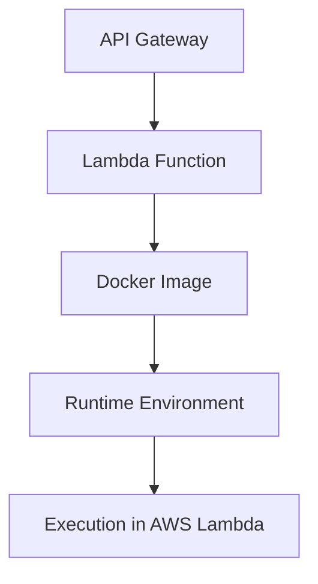

# Deploy API with API Gateway and Lambda

## **Overview**

This guide explains how to deploy an API using AWS API Gateway integrated with AWS Lambda. This setup is ideal for
serverless applications with low latency and scalability.

## **Steps**

### 1. Define the Lambda Function

Use the `createApiLambdaStack` method to define your Lambda function and API Gateway integration. Specify runtime,
handler, and configurations.

**Example:**

```typescript
    const lambdaExportProps: ApiLambdaStackProps = {
        env: { account: "425287461358", region: "eu-west-1" },
        name: "ApiLambda",
        githubRepo: "cdk-intro-workshop",
        stackName: "cdk-intro-workshop-ApiLambda",
        pathDockerFile: "./workshop/src/apps/Minimal.Api/",
        dockerFile: "Dockerfile",
        envName: "Production",
        functionName: "cdk-intro-workshop-api-production",
        timeoutSeconds: 29,
        memorySizeMbs: 1024,
        vpc: { vpcId: "vpc-ee04cd97" },
        vpcSubnets: {
            subnetType: "PRIVATE_WITH_EGRESS",
        },
    };

    new ApiLambdaStack(this.props.scope, lambdaExportProps);
}
```

### 2. Define the API Gateway

Use the `createApiGateway` method to integrate the Lambda function with API Gateway.

**Example:**

```typescript
    const apiProps: ApiGatewayStackProps = {
        env: { account: "425287461358", region: "eu-west-1" },
        name: "ApiGateway",
        githubRepo: "cdk-intro-workshop",
        stackName: "cdk-intro-workshop-ApiGateway",
        envName: "Production",
        lambdaFunction: lambdaFunction,
        certificateArn: `arn:aws:acm:us-east-1:425287461358:certificate/be63062d-5316-47af-9f94-819c1dc02853`,
        subdomain: "api",
        domain: "m47.io",
    };
    
    return new ApiGatewayStack(this.props.scope, apiProps);
}
```

### 3. Deploy the Stack

Use the AWS CDK CLI to deploy the stack.

**Command:**

```bash
cdk deploy cdk-intro-workshop-ApiGateway
```

### **Stack Diagram**

Below is a flowchart visualizing the stack:



### **Additional Concepts**

Before deploying APIs, ensure you understand [Lambda Runtime Support (LRS)](lambda-runtime-support.md).
